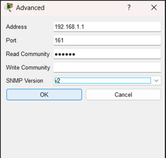
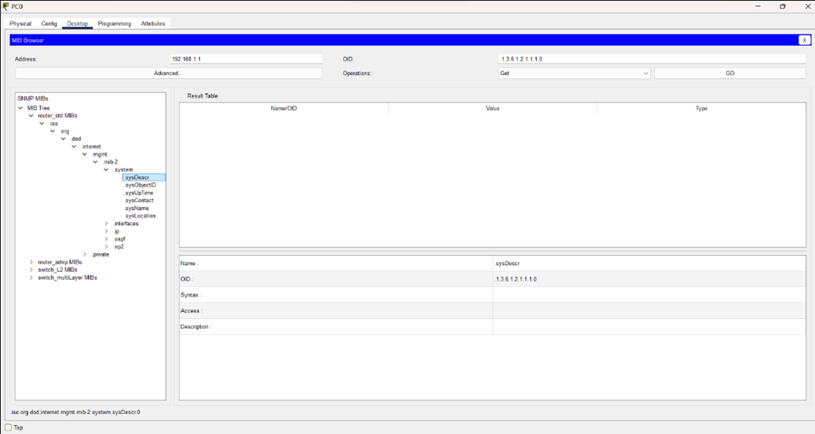

 🔍 Consulta SNMP Básica

## Objetivo
Validar o funcionamento do serviço SNMP configurado no roteador,
realizando uma consulta por meio de um MIB Browser.

## Configuração da Consulta

A imagem abaixo mostra a configuração do MIB Browser utilizado
para acessar o agente SNMP do roteador.

## Resultado da Consulta

Após a configuração, foi realizada a consulta SNMP, retornando
informações do dispositivo a partir da MIB.

## Conclusão
O serviço SNMP está ativo e acessível, permitindo a obtenção
de informações do dispositivo.
