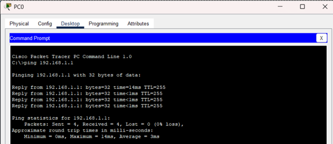

# ✅ Teste de Conectividade

## Objetivo
Validar a comunicação entre o host e o roteador após a configuração
da interface de rede.

Configuração de IP estático no host:
  - IP: 192.168.1.2
  - Máscara: 255.255.255.0
  - Gateway: 192.168.1.1

- Teste realizado utilizando ICMP (ping).

# Procedimento
Foi realizado um teste de conectividade utilizando ICMP (ping)
do host para o endereço do roteador `192.168.1.1`.

## Evidência

A imagem abaixo comprova que o roteador respondeu corretamente
às requisições ICMP.

